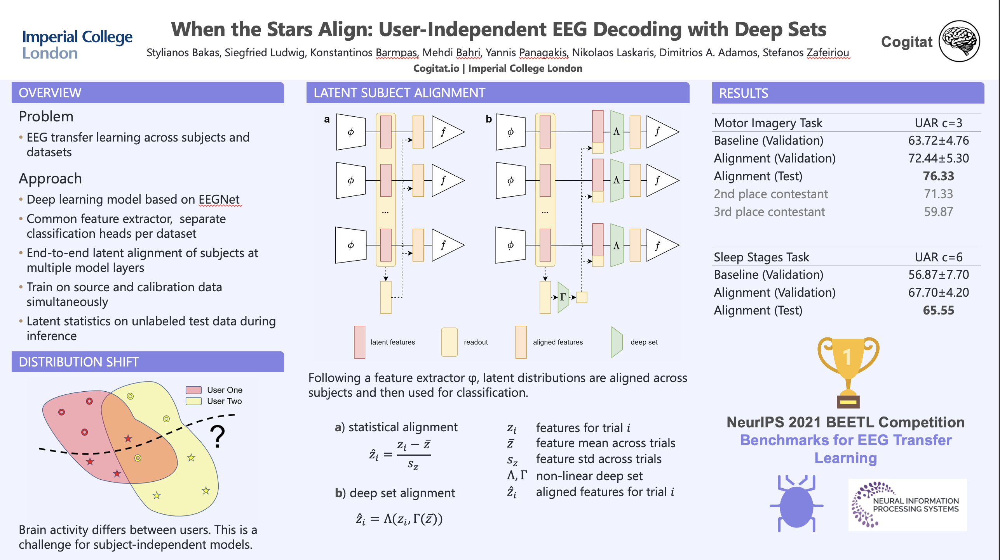

Authors: Stylianos Bakas, Siegfried Ludwig, <strong>Konstantinos Barmpas</strong>, Mehdi Bahri, Yannis Panagakis, Nikolaos Laskaris, Dimitrios A. Adamos and Stefanos Zafeiriou

Building subject-independent deep learning models for EEG decoding faces the challenge of strong covariate-shift across different datasets, subjects and recording sessions. Our approach to address this difficulty is to explicitly align feature distributions at various layers of the deep learning model, using both simple statistical techniques as well as trainable methods with more representational capacity. This follows in a similar vein as covariance-based alignment methods, often used in a Riemannian manifold context.

The methodology proposed herein won first place in the 2021 Benchmarks in EEG Transfer Learning ([BEETL](https://beetl.ai/introduction)) competition, hosted at the NeurIPS conference. The first task of the competition consisted of sleep stage classification, which required the transfer of models trained on younger subjects to perform inference on multiple subjects of older age groups without personalized calibration data, requiring subject-independent models. The second task required to transfer models trained on the subjects of one or more source motor imagery datasets to perform inference on two target datasets, providing a small set of personalized calibration data for multiple test subjects.

**NeurIPS2021 BEETL Poster**

