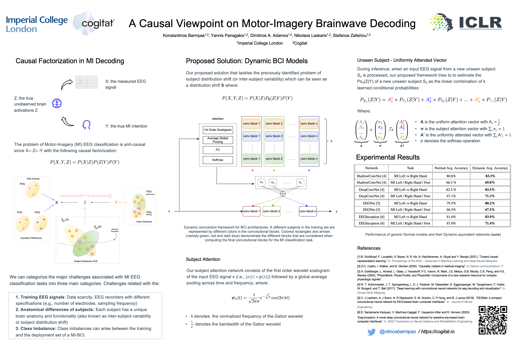

Authors: <strong>Konstantinos Barmpas</strong>, Yannis Panagakis, Dimitrios Adamos, Nikolaos Laskaris and Stefanos Zafeiriou

[Workshop Page](https://objects-structure-causality.github.io) [Repo](https://github.com/KonstantinosBarmpas/Dynamic-BCI-Models)

In this work, we employ causal reasoning to breakdown and analyze important challenges of the decoding of Motor-Imagery (MI) electroencephalography (EEG) signals. Furthermore, we present a framework consisting of dynamic convolu- tions, that address one of the issues that arises through this causal investigation, namely the subject distribution shift (or inter-subject variability). Using a publicly available MI dataset, we demonstrate increased cross-subject performance in two different MI tasks for four well-established deep architectures.

**Poster**

