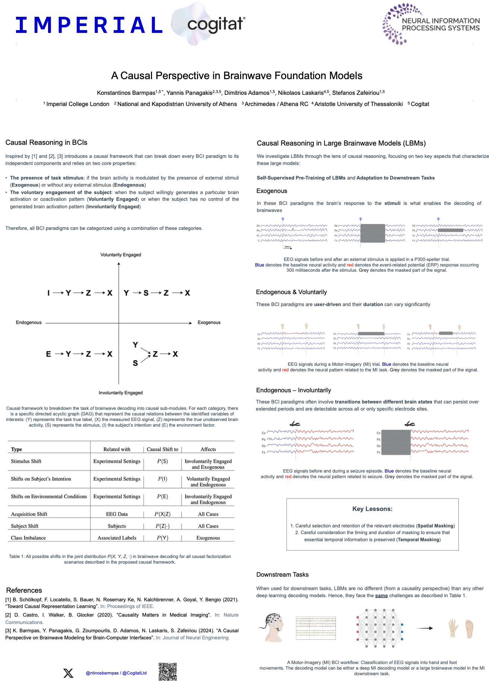

Authors: <strong>Konstantinos Barmpas</strong>, Yannis Panagakis, Dimitrios Adamos, Nikolaos Laskaris and Stefanos Zafeiriou

[[NeurIPS CaLM Page](https://neurips.cc/virtual/2024/workshop/84710)] - [[Workshop Page](https://calm-workshop-2024.github.io)] - [[Repo](https://github.com/KonstantinosBarmpas/Causality-for-LBMs)]

Foundation Models have recently emerged as powerful tools in various domains of AI, showing potential for significant advancements in Brain-Computer Interfaces (BCIs). However, the initial implementations of Large Brainwave Models (LBMs) face significant challenges when applied to real-world scenarios, primarily due to various distribution shifts. This work examines the training process of these LBMs through a causal reasoning perspective, identifying key challenges that impact their performance. By doing so, we aim to provide insights that can guide the development of more robust and effective LBMs for BCI applications.

**NeurIPS2024 CaLM Poster**

