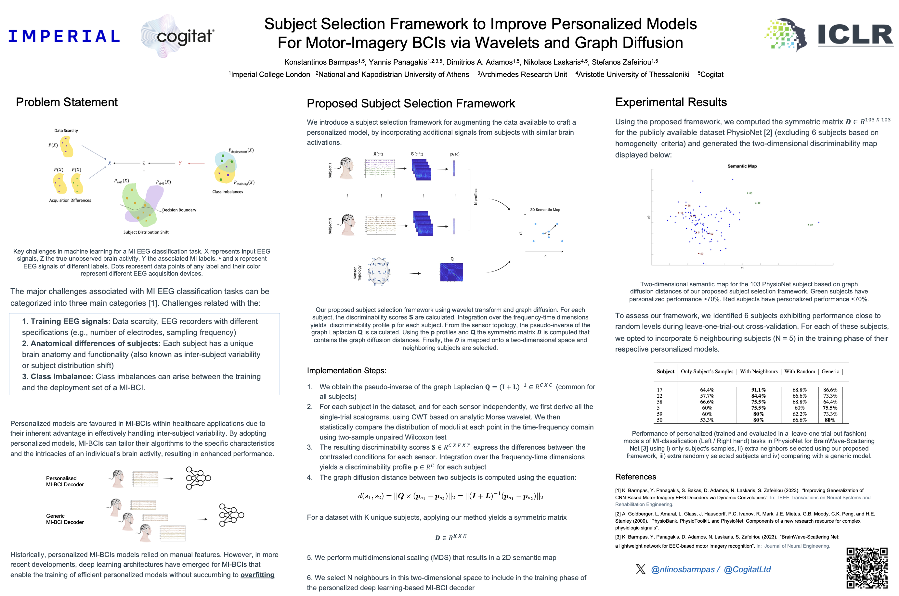

Authors: <strong>Konstantinos Barmpas</strong>, Yannis Panagakis, Dimitrios Adamos, Nikolaos Laskaris and Stefanos Zafeiriou

[[ICLR TS4H Page](https://iclr.cc/virtual/2024/workshop/20582)] - [[Workshop Page](https://timeseriesforhealth.github.io)] - [[Repo](https://github.com/KonstantinosBarmpas/Subject-Pooling)]

Personalized electroencephalogram (EEG) decoders hold a distinct preference in healthcare applications, especially in the context of Motor-Imagery (MI) Brain-Computer Interfaces (BCIs), owing to their inherent capability to effectively tackle inter-subject variability. This study introduces a novel subject selection framework that blends ideas from discriminative learning (based on continuous wavelet transform) and graph-signal processing (over the sensor array). Through experimentation with a publicly available MI dataset, we showcase enhanced personalized performance for MI-BCIs. Notably, it proves particularly advantageous for subjects who initially demonstrated suboptimal personalized performance.

**ICLR24 TS4H Poster**

