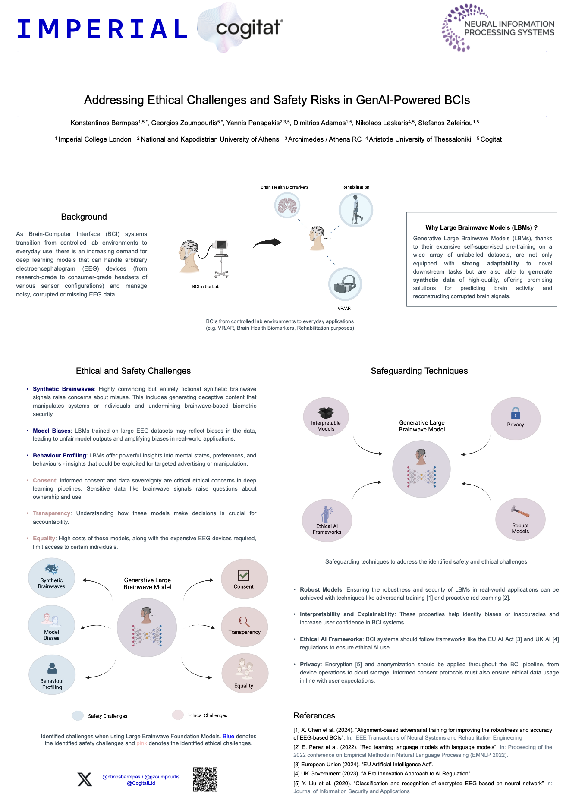

Authors: <strong>Konstantinos Barmpas</strong>, Georgios Zoumpourlis, Yannis Panagakis, Dimitrios Adamos, Nikolaos Laskaris and Stefanos Zafeiriou

[[NeurIPS GenAI4Health Page](https://neurips.cc/virtual/2024/workshop/84723)] - [[Workshop Page](https://genai4health.github.io)] - [[Repo](https://github.com/KonstantinosBarmpas/GenAI4Health-BCIs-Safety)]

The use of Generative AI (GenAI) in developing large brainwave foundation models for Brain-Computer Interfaces (BCIs) offers enormous potential but also comes with several key safety and ethical concerns. This work identifies these challenges and highlights cases of potential misuse of GenAI in BCIs, including synthetic neural activity, behaviour profiling, privacy and equality risks. Finally, it emphasizes the importance of essential safeguarding techniques to mitigate these risks, such as innovative technological solutions and proper regulatory and ethical frameworks.

**NeurIPS GenAI4Health Poster**

